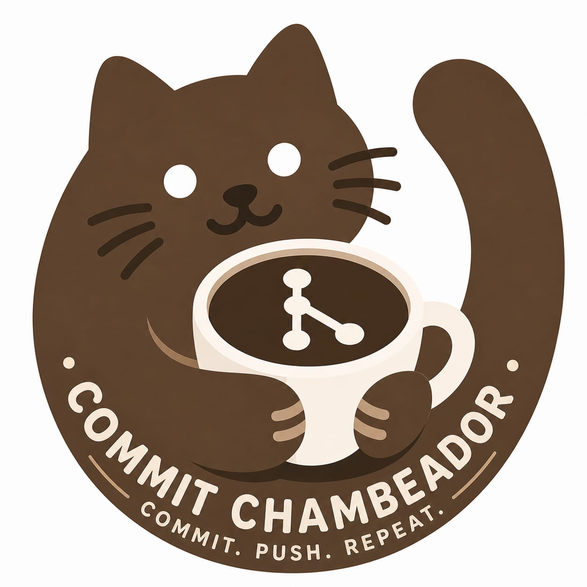

<p align="center">
  
</p>

<h1 align="center">Commit Chambeador</h1>

## Equipo

<table align="center">
  <tr>
    <td>
      <strong>Delia MAite Acosta Orellana</strong><br>
      Cel: 68907099
    </td>
    <td align="right">
      
    </td>
  </tr>

  <tr>
    <td>
      <strong>Francisco Lazarte Salazar</strong><br>
      Cel: 70739012
    </td>
    <td align="right">
      
    </td>
  </tr>

  <tr>
    <td>
      <strong>Mauricio Alail Cano Gutierrez 3</strong><br>
      Cel: 69548789
    </td>
    <td align="right">
      
    </td>
  </tr>

  <tr>
    <td>
      <strong>Angelica Adriana Soto Jiménez</strong><br>
      Cel: 68444415
    </td>
    <td align="right">
      
    </td>
  </tr>
</table>

---

## Descripción del proyecto

Commit Chambeador es una landing page de una cafetería donde los usuarios pueden visualizar diferentes secciones del menú como desayunos, bebidas, postres, combos y opciones saludables.

El objetivo del proyecto es aplicar buenas prácticas y practicar el uso de Git Flow en el trabajo en equipo.

---

## Tecnologías utilizadas

- HTML
- CSS
- Git & GitHub

---

## Cómo ejecutar el proyecto

El proyecto está disponible en GitHub Pages en el siguiente enlace: https://fran-laz.github.io/Practica_grupal/

O de forma local:

1. Clonar el repositorio:
```bash
git clone https://github.com/fran-laz/Practica_grupal.git
```
1. Abrir la carpeta del proyecto
2. Abrir el archivo index.html en el navegador o usar la extensión Live Server en VS Code
